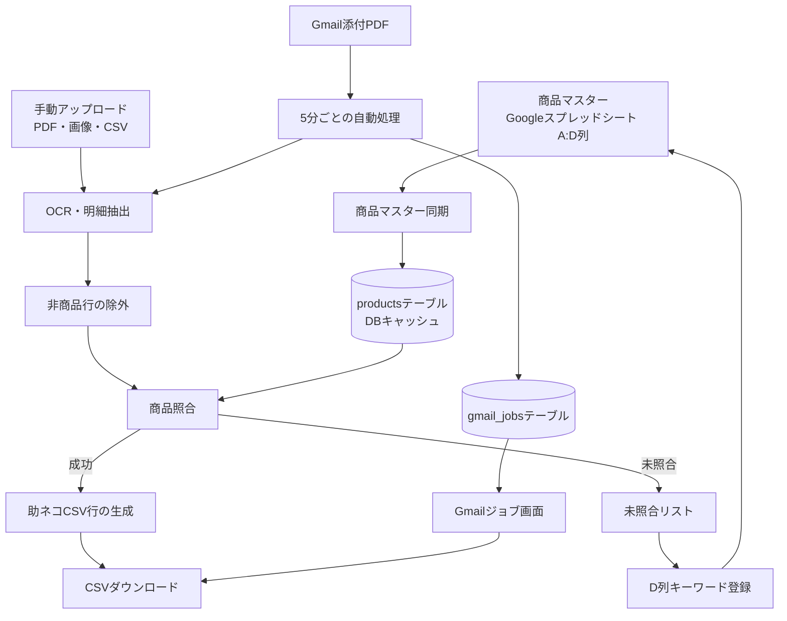
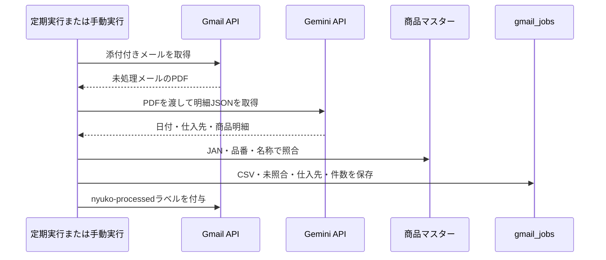

# 入庫変換アプリ：全容資料

> **目的**：本書は、入庫変換アプリが「何を解決するアプリか」「どのように動くか」「日常的にどう使うか」「どこに注意して保守すべきか」を、業務担当者と開発者の双方が把握できるようにまとめたものです。  
> **機密情報の扱い**：APIキー、パスワード、GoogleスプレッドシートID、OAuthトークンなどの実値は本書に記載しません。すべてシークレット管理で扱います。

## 1. アプリの目的

入庫変換アプリは、仕入先から届く納品書PDF・納品書画像・指定CSVを読み取り、社内の商品マスターと照合し、**助ネコへ取り込める在庫CSV**へ変換する業務アプリです。複合機からGmailへ送られたPDFを定期的に取得して同じ変換処理を行う、Gmail自動取り込みも備えています。[1] [2]

このアプリが扱う中心課題はOCRだけではありません。納品書上の**JANコード、仕入先品番、商品名**を、社内の**自社商品コード**へ正しく紐付けること、そして初回に照合できなかった納品書表記を「納品書キーワード」として蓄積し、次回以降の自動照合精度を高めることが本質です。[2] [3]

| 項目 | 内容 |
|---|---|
| 主な入力 | PDF、JPG/PNG/WebP画像、十二堂向けCSV、Gmail添付PDF |
| 主な出力 | 助ネコ在庫CSV |
| 商品マスターの正本 | Googleスプレッドシート「全商品取り扱いリスト」 |
| OCR・構造化抽出 | Gemini API（`gemini-2.5-flash`） |
| 自動取り込み | Gmail APIと定期実行 |
| 履歴・キャッシュ | MySQL/TiDB互換DB |

## 2. 利用者から見た業務フロー

通常は「商品マスターの同期」→「納品書投入」→「変換結果確認」→「CSVダウンロード」→「未照合の学習」という流れで利用します。Gmail自動取り込みでは納品書の投入をメール送信に置き換えるだけで、OCR・照合・CSV生成の中核は同じです。

### 日常の標準手順

1. 商品マスターを編集した後は、メイン画面で**「スプレッドシートから同期」**を実行します。
2. 納品書の形式に合った処理モードを選び、ファイルを追加します。
3. **「変換・処理実行」**を押し、変換件数・未登録件数・エラー・処理ログを確認します。
4. 自社商品コードと数量が原本どおりであることを確認してからCSVをダウンロードします。
5. 未照合商品がある場合は、原本と商品マスターを確認したうえで、正しい商品だけをD列キーワードに登録します。
6. D列を更新した場合は、改めて商品マスターを同期します。

> **重要**：未照合リストには、OCRが誤認した表ヘッダー・住所・会社名・断片文字が混ざる可能性があります。商品明細ではないものをD列へ登録すると、今後の照合を誤らせるため、必ず原本を確認してください。

## 3. 画面構成と使い方

### 3.1 ログイン画面

ログイン画面では、登録したアプリ用パスワードを入力します。ログイン成功後、ブラウザの`sessionStorage`に`nyuko_auth`を保存し、メイン画面とGmailジョブ画面へ遷移します。[10] [11]

> **現状の留意点**：これはフロントエンド上の簡易的なログイン状態管理です。REST API自体に認可ミドルウェアはありません。社外公開・複数ユーザー・権限管理を行う場合は、サーバー側セッションまたはManus OAuth等を使ったAPI保護へ変更する必要があります。

### 3.2 メイン画面

メイン画面は、商品マスター同期、Gmailジョブへの導線、処理モード選択、ファイル追加、変換実行、変換結果の確認をまとめた操作画面です。通常のPDF・画像モードは複数ファイルを一度に扱えます。変換結果は自社商品コードと入庫日単位で数量を合算します。[8] [2]

| 処理モード | 入力 | 用途 | 実際の処理 |
|---|---|---|---|
| JAN読み取りJPG | JPG/PNG/WebP | 画像形式の納品書 | Geminiで明細を抽出し商品マスターと照合 |
| JAN読み取りPDF | PDF | PDF形式の納品書 | Geminiで明細を抽出し商品マスターと照合 |
| 商品名・商品コード読み取りPDF | PDF/画像 | JANがない帳票 | 品番・商品名・D列キーワードを使って照合 |
| 十二堂CSV変換 | Shift-JIS CSV | 十二堂用のCSV | OCRを使わず、専用の商品対応表で変換 |

変換後は「変換成功」「未登録」「エラー」の件数、助ネコ形式のプレビュー、未登録リスト、処理ログが表示されます。CSVダウンロード時にはUTF-8 BOMが付与され、ファイル名は`助ネコ在庫up{仕入先名}{MMDD}.csv`になります。[8]

### 3.3 Gmail自動取り込み画面

Gmailジョブ画面では、Gmail接続状態、直近の処理ジョブ、未ダウンロードのCSV、未照合の詳細を確認します。**「今すぐ取り込む」**は、自動実行を待たずにGmailの未処理メールを処理するためのボタンです。[9] [4]

ジョブ単位でCSVをダウンロードすると、`downloadedAt`が保存され、未ダウンロードの強調表示が解除されます。未照合の詳細画面では、抽出された商品名・仕入先品番・JANを確認し、**「D列に登録」**を使って次回以降の照合を改善できます。[9]

## 4. 納品書から助ネコCSVまでの仕組み

### 4.1 Geminiによる明細抽出

`server/ocr.ts`は、PDFまたは画像のバイナリをBase64化し、Gemini APIへ`inline_data`として渡します。GeminiにはJSON形式の回答を要求し、日付、仕入先、商品名、仕入先品番、JAN、数量を抽出します。現行実装は、Manus内蔵LLMを経由せず、`GEMINI_API_KEY`を用いてGemini APIを直接呼び出します。[1]

抽出における主要ルールは次のとおりです。

| 項目 | 取り扱い |
|---|---|
| JAN | 数字のみへ正規化し、`984000`で始まる番号は除外 |
| 仕入先品番 | 英数字・ハイフンを含む品番、型番、商品コードを抽出 |
| 商品名 | 商品・製品の明細名のみを抽出 |
| 数量 | 整数で取得。入数・ケース数がある場合は納品総数を採用 |
| 日付 | 納品日または発行日を`YYYY/MM/DD`形式で取得 |
| 仕入先名 | 納品書の発行元を取得 |

Geminiのプロンプトでは、挨拶文、表ヘッダー、納品書などの書類タイトル、会社名だけの行、住所、合計・税・送料・手数料、繰越行、数字だけの行、1〜2文字の断片を抽出対象から除外するよう指示しています。さらに、Gemini出力後にもサーバー側の正規表現で「金額」「区分」「数量 単位」「納品書」「売上伝票」等を除外します。[1]

### 4.2 商品マスター

商品マスターの正本は、Googleスプレッドシート「全商品取り扱いリスト」です。アプリはA〜D列を読み込み、DBの`products`テーブルへ同期します。DBは高速照合用のキャッシュであり、業務上の正本はスプレッドシートです。[3]

| スプレッドシート列 | DBフィールド | 役割 |
|---|---|---|
| A列 | `jan` | JAN完全一致の照合値 |
| B列 | `code` | 助ネコCSVへ出力する自社商品コード |
| C列 | `nameKeywords` | 正式商品名・商品名照合用キーワード |
| D列 | `deliveryKeywords` | 納品書上の別名、仕入先品番、表記揺れを蓄積するカンマ区切りキーワード |

同期では、DBの`products`を入れ替え、500件ずつ書き込みます。商品マスター読込時には、まずDBを参照し、5分間のメモリキャッシュを利用します。DBが空、または接続できない場合は、スプレッドシートを直接読み込むフォールバックがあります。[3]

### 4.3 照合の優先順位

手動変換とGmail自動処理は、以下の順序で照合します。[2] [4]

1. **JAN完全一致**：8桁以上のJANがマスターA列に存在する場合、対応する自社商品コードを採用します。
2. **仕入先品番照合**：JANが存在しない場合に限って、抽出した仕入先品番を使います。
3. **仕入先プレフィックスで絞った名称・D列照合**：仕入先名からプレフィックスを推定できる場合、その接頭辞を持つ自社商品コードだけを候補にします。
4. **全商品対象の名称・D列照合**：残った候補に対して、C列とD列を結合したキーワード集合であいまい照合します。
5. **未照合**：どの照合にも成功しない場合はCSVに出さず、確認対象として画面へ出します。

**JANが取得できたがマスターに存在しない場合は、仕入先品番・商品名で再照合しません。** これは、誤読したJANがある状態で似た名称の別商品へ誤マッチすることを避ける安全策です。[2] [4]

### 4.4 D列キーワードによる学習

D列へキーワードを登録する操作は、既存の値を置き換えず、カンマ区切りで追記します。同じキーワードは重複登録しません。[3]

手動画面では、未照合商品に対して正しい自社商品コードを選んでキーワードを登録します。Gmailジョブ画面では、仕入先品番、JAN、商品名の順で登録対象を決めます。[8] [9]

> **同期の注意**：D列更新後、メイン画面の「スプレッドシートから同期」を実行してDBキャッシュを更新してください。現在、Gmailジョブ画面経由のD列登録はスプレッドシートへは書き込みますが、DB再同期までは実行しません。[2] [3]

### 4.5 助ネコCSVの内容

照合成功した明細は、同じ自社商品コード・同じ入庫日で数量を合算したうえで出力します。[2] [4]

| CSV列 | 値 |
|---|---|
| 自社商品コード | マスターB列の自社商品コード |
| 在庫指定 | `通常在庫` |
| 在庫数 | 納品書から抽出した数量。重複コードは合算後の数量 |
| 入庫日 | 抽出した日付。取得できない場合は処理日 |
| 入庫時間 | `00:00` |
| 備考 | Gmail自動処理では仕入先名、手動変換では空欄 |

## 5. Gmail自動取り込み

Gmail自動取り込みは、複合機から送られたPDFを人手で保存せずに処理する機能です。定期実行が`POST /api/scheduled/gmail-fetch`を呼び、Gmailの未処理PDF添付メールを取得します。ジョブ画面の「今すぐ取り込む」は`POST /api/gmail-fetch-now`を呼び、同じ処理を直ちに実行します。[4]

Gmail連携はOAuth 2.0のClient ID、Client Secret、Refresh Tokenを使います。取得対象は添付付きメールで、処理済みメールには`nyuko-processed`ラベルを付け、重複処理を避けます。[5]

処理結果は`gmail_jobs`テーブルへ保存されます。メールID、件名、送信者、ファイル名、処理日時、変換件数、未照合件数、CSV本文、未照合明細、仕入先名、状態、ダウンロード日時を履歴として保持します。[6] [4]

## 6. 十二堂CSV変換

十二堂CSVモードはOCRを使いません。Shift-JISのCSVを読み込み、列1を十二堂コード、列2を数量、列3を日付として扱います。スプレッドシートの「十二堂商品リスト」A:C列から取得した対応表で、十二堂コードを助ネココードへ変換します。[2] [3]

日付は`YYYYMMDD`、`YYYY-MM-DD`、`YYYY/MM/DD`を`YYYY/MM/DD`へ整形します。対応表にないコードは未登録として表示し、CSVには出力しません。[2]

## 7. システム構成

| 層 | 技術・責務 |
|---|---|
| フロントエンド | React 19、TypeScript、Vite、Tailwind CSS、Wouter。メイン画面とGmailジョブ画面を提供。[8] [9] [12] |
| サーバー | Node.js、Express 4。ファイル処理、OCR、同期、Gmail用REST APIを提供。[7] [12] |
| DB | MySQL/TiDB互換、Drizzle ORM。商品キャッシュとGmailジョブ履歴を保存。[6] [12] |
| 商品マスター | Google Sheets API。A:D列読込とD列更新を実施。[3] |
| OCR | Gemini API。PDF・画像をインラインデータとして送信。[1] |
| メール | Gmail API。OAuth 2.0で接続。[5] |
| 定期実行 | 外部の定期実行が`/api/scheduled/gmail-fetch`を呼ぶ前提。[4] |

サーバーの起点は`server/_core/index.ts`です。ここでExpressを構成し、`/api`配下に処理・同期・Gmailの各ルーターを登録します。起動時に商品マスターDBが空の場合は、スプレッドシートから自動同期します。[7]

## 8. データベース

| テーブル | 主なカラム | 役割 |
|---|---|---|
| `products` | `jan`, `code`, `nameKeywords`, `deliveryKeywords`, `syncedAt` | スプレッドシート商品マスターの高速照合用キャッシュ |
| `gmail_jobs` | `messageId`, `filename`, `rowCount`, `notFoundCount`, `csvContent`, `notFoundContent`, `supplier`, `downloadedAt` | Gmail処理の結果とダウンロード状態を保存する履歴 |
| `users` | `openId`, `email`, `role`ほか | テンプレート標準のManus OAuth用ユーザー情報。現行の画面ログインでは未使用 |

## 9. REST API一覧

| メソッド | パス | 用途 |
|---|---|---|
| POST | `/api/auth/login` | パスワード照合 |
| POST | `/api/process` | PDF・画像の手動変換。`files`は最大20件 |
| POST | `/api/process-junidou-csv` | 十二堂CSVの変換 |
| GET | `/api/sync-status` | 商品マスターの件数・最終同期日時 |
| POST | `/api/sync-products` | スプレッドシートA:D列をDBへ同期 |
| GET | `/api/product-codes` | 手動キーワード登録用の商品コード一覧 |
| POST | `/api/register-keyword` | D列キーワードの追記。後述の重複実装に注意 |
| GET | `/api/gmail-status` | Gmail接続確認 |
| GET | `/api/gmail-jobs` | 直近50件のGmailジョブ一覧 |
| POST | `/api/gmail-fetch-now` | Gmail取り込みの手動実行 |
| POST | `/api/scheduled/gmail-fetch` | 定期実行用のGmail取り込み |
| POST | `/api/gmail-jobs/:id/downloaded` | CSVダウンロード済みフラグの更新 |
| GET | `/api/gmail-debug` | Gmailのデバッグ情報。公開運用では無効化を推奨 |

## 10. 必要なシークレット・外部設定

| 変数 | 必須度 | 用途 | 注意点 |
|---|---|---|---|
| `GEMINI_API_KEY` | 必須 | GeminiによるOCR・構造化抽出 | 利用上限・課金・API制限はGoogle側で管理。値は公開しない |
| `SPREADSHEET_ID` | 必須 | 商品マスターの参照先 | サービスアカウントへ閲覧・更新権限を付与 |
| `GOOGLE_SERVICE_ACCOUNT_JSON` | 必須 | Google Sheets API認証 | JSON全体をシークレットとして保存 |
| `GMAIL_CLIENT_ID` | Gmail利用時 | Gmail OAuthクライアントID | Gmail APIを有効化 |
| `GMAIL_CLIENT_SECRET` | Gmail利用時 | Gmail OAuthクライアントシークレット | クライアント側へ露出させない |
| `GMAIL_REFRESH_TOKEN` | Gmail利用時 | Gmailの継続接続 | `invalid_grant`時は再発行が必要 |
| `APP_PASSWORD` | 必須 | 現行ログイン画面のパスワード | サーバー側認可ではないことに留意 |
| `DATABASE_URL` | 必須 | DB接続 | プラットフォームのシークレット管理を利用 |

過去に利用していたDocument AI向けの依存パッケージ・環境変数が一部残っていますが、現行のOCR処理はDocument AIを呼び出しません。移行確認後に不要な依存と設定を整理する余地があります。[1] [12]

## 11. 保守上の重要な注意点と改善優先度

### 11.1 最優先：照合精度

現行の`matchBySupplierCode`は、D列に登録済みの仕入先品番を直接完全一致で検索する実装ではなく、自社商品コードのハイフン以降と抽出品番を比較しています。[3]

そのため、納品書品番とD列の登録内容が一致していても、ハイフン・ゼロ埋め・表記差で品番照合に失敗し、後段の商品名あいまい照合が似た別商品を採用する可能性があります。以下の改善が最優先です。

1. D列をカンマ単位へ分割し、品番を全角半角・大文字小文字・ハイフン・空白を正規化して**完全一致**で最優先照合する。
2. 商品名のあいまい照合に確信度を設け、低確信度の場合は自動採用せず未照合へ回す。
3. 名称照合成功時にD列へ自動追記する仕様を見直し、誤照合が自己増殖しないようにする。

### 11.2 高優先：認証・公開範囲

現行ログインは`sessionStorage`による画面制御で、サーバーのREST APIは認可されていません。また、Gmailデバッグ情報を返すエンドポイントが存在します。業務アプリとして利用範囲を拡大する前に、サーバー側の認証・認可を導入し、デバッグAPIを本番から外すべきです。[10] [11] [4]

### 11.3 中優先：APIと副作用の整理

`POST /api/register-keyword`は`processRouter`と`syncRouter`の双方に定義されています。ルーター登録順により実行される実装が変わり、D列更新後にDB同期を行うかどうかも統一されていません。エンドポイントを一つに統合し、D列追記・DB同期・結果返却を一貫処理にすることを推奨します。[2] [7] [13]

### 11.4 中優先：同期とGmailの堅牢性

商品マスター同期はDBの全削除後に再投入する方式です。同期中の失敗や同時実行に備え、トランザクション、世代管理、または一時テーブルを検討できます。また、`gmail_jobs`に`messageId`の一意制約がないため、再実行時の重複保存と失敗メールの再処理設計も改善候補です。[3] [6]

### 11.5 中優先：OCR運用

Gemini APIは外部サービスです。キー未設定、クォータ超過、課金設定、ネットワーク障害が起きると抽出が失敗します。現状はエラーを画面へ返しますが、再試行、指数バックオフ、失敗した原本の保管、帳票ごとの精度測定は未実装です。[1] [2]

## 12. 開発時のコード案内

| ファイル | 役割 | 変更時の注意 |
|---|---|---|
| `server/ocr.ts` | Gemini API呼び出し、JSON解析、非商品フィルタ | プロンプト変更は実帳票で回帰確認する |
| `server/processRouter.ts` | 手動変換、照合、CSV生成、十二堂CSV、D列登録 | Gmail側との照合ロジック差分を作らない |
| `server/gmailScheduler.ts` | Gmail自動処理、ジョブ保存、定期実行API | 手動側と共通化できるロジックを検討する |
| `server/gmail.ts` | Gmail OAuth、PDF取得、ラベル付与 | 認証更新・再処理の挙動を確認する |
| `server/sheets.ts` | Sheets同期、D列書込み、照合関数 | 照合品質の中心。正規化・候補選定を集約する |
| `server/syncRouter.ts` | 商品マスター同期API | キーワード登録APIの統合対象 |
| `drizzle/schema.ts` | DBスキーマ | Drizzleマイグレーションと実DBを常に一致させる |
| `server/_core/index.ts` | Express起動・ルーター登録 | APIパス衝突と起動時同期を確認する |
| `client/src/pages/Main.tsx` | 手動変換画面 | APIレスポンスと表示件数の整合性を保つ |
| `client/src/pages/GmailJobs.tsx` | Gmailジョブ・未照合登録画面 | 誤った未照合項目を登録させないUIを強化する |

## 13. テスト・リリース前の確認

開発コマンドは`pnpm check`（TypeScript検査）、`pnpm test`（Vitest）、`pnpm build`（本番ビルド）です。[12]

照合ロジックを変える場合は、少なくとも以下のケースを自動テストと実帳票で確認してください。

| ケース | 期待結果 |
|---|---|
| マスターに存在するJAN | JAN完全一致で正しい自社商品コード |
| JANあり・未登録 | 品番・名称へ勝手にフォールバックせず未照合 |
| JANなし・D列品番あり | D列品番の完全一致で正しい自社商品コード |
| 似た商品名 | 低確信度は未照合。別商品へ自動採用しない |
| 表ヘッダー・会社名・住所 | 商品明細として出力しない |
| 同一コードが複数行 | 同じ入庫日で数量を合算 |
| Gmail処理 | CSV保存、未照合保存、処理済みラベル、ダウンロード状態を確認 |

リリース前には、実際の帳票または機密を除いたテスト帳票で、生成された自社商品コード・数量・日付を原本と突き合わせてください。特に、JANのない納品書と、新しい仕入先の帳票では必須です。

## 14. 用語

| 用語 | 意味 |
|---|---|
| 自社商品コード | 助ネコCSVへ出力する社内コード。スプレッドシートB列 |
| JAN | 商品バーコード番号。マスターA列で完全一致照合する |
| 仕入先品番 | 仕入先やメーカーが帳票に載せる品番、型番、商品コード |
| 納品書キーワード | スプレッドシートD列。別名・品番・表記揺れを登録する学習領域 |
| 未照合 | 確実なマスター対応が見つからず、CSV出力から除外された明細 |
| Gmailジョブ | Gmailから取り込んだPDF1件の変換結果・CSV・未照合を保存した履歴 |

## 参考実装

[1]: ../server/ocr.ts "OCR・Gemini API直接呼び出し"
[2]: ../server/processRouter.ts "手動変換・照合・CSV生成API"
[3]: ../server/sheets.ts "商品マスター同期・照合・D列更新"
[4]: ../server/gmailScheduler.ts "Gmail自動処理・ジョブ保存"
[5]: ../server/gmail.ts "Gmail API連携・処理済みラベル"
[6]: ../drizzle/schema.ts "DBスキーマ"
[7]: ../server/_core/index.ts "サーバー起動・ルーター登録"
[8]: ../client/src/pages/Main.tsx "手動変換画面"
[9]: ../client/src/pages/GmailJobs.tsx "Gmailジョブ画面"
[10]: ../client/src/contexts/AuthContext.tsx "画面ログイン状態管理"
[11]: ../client/src/App.tsx "画面ルーティング"
[12]: ../package.json "依存関係・開発コマンド"
[13]: ../server/syncRouter.ts "商品マスター同期API"
